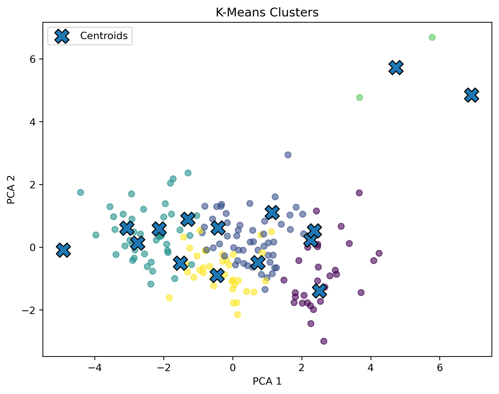
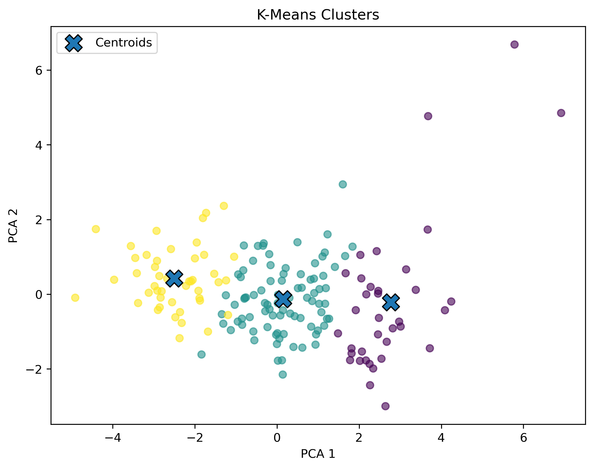
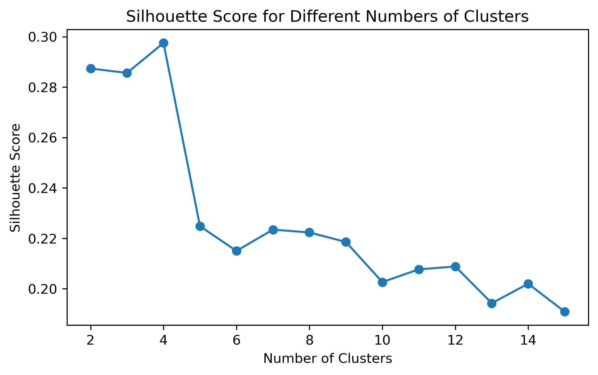

# Country Clustering using K-Means

## In the name of Allah, the Most Gracious, the Most Merciful

In this project, I used **K-Means Clustering** to group countries based on their economic, health, and demographic features.

The main goal was to practice **Unsupervised Learning** and understand how clustering can be used to discover patterns in data without predefined labels.

## Dataset

The dataset contains information about **167 countries** and includes features such as:

* Child Mortality
* Exports
* Health
* Imports
* Income
* Inflation
* Life Expectancy
* Total Fertility
* GDPP

The `country` column was used as an identifier and was not included as a feature for clustering.

## What I Did

### 1. Data Exploration

I explored the dataset, checked its shape, data types, and missing values, and got familiar with the features.

### 2. Feature Selection

I selected the numerical features that describe the economic, health, and demographic conditions of each country.

### 3. Feature Scaling

I used **StandardScaler** to scale the features because they have different ranges and K-Means is distance-based.

### 4. K-Means Clustering

I applied **K-Means Clustering** and experimented with different numbers of clusters.

### 5. Choosing the Number of Clusters

I used:

* **Elbow Method** to observe how the inertia changes with different numbers of clusters.
* **Silhouette Score** to check how well the data points are separated into clusters.

Based on the results, I chose **3 clusters**.

### 6. Cluster Analysis

After training the final K-Means model, I analyzed the average feature values of each cluster to understand their characteristics.

The clusters showed differences in economic, health, and demographic conditions.

### 7. Visualization

I used **PCA (Principal Component Analysis)** to reduce the 9-dimensional feature space to 2 dimensions and visualize the three clusters in one graph.

## Results

The final model grouped the countries into **3 clusters** with different characteristics.

* **Cluster 0:** Generally higher income and GDPP, lower child mortality and fertility, and higher life expectancy.
* **Cluster 1:** Moderate economic and health conditions.
* **Cluster 2:** Generally lower income and GDPP, higher child mortality and fertility, and lower life expectancy.

## Tools & Libraries

* Python
* Pandas
* NumPy
* Matplotlib
* Scikit-learn
* Jupyter Notebook

## What I Learned

Through this project, I practiced the main steps of an **Unsupervised Learning** problem, from exploring and preparing the data to applying K-Means, choosing the number of clusters, interpreting the results, and visualizing the clusters.

`Basmala Hussein`

An aspiring ML engineer & software and multimedia student 

09/26 